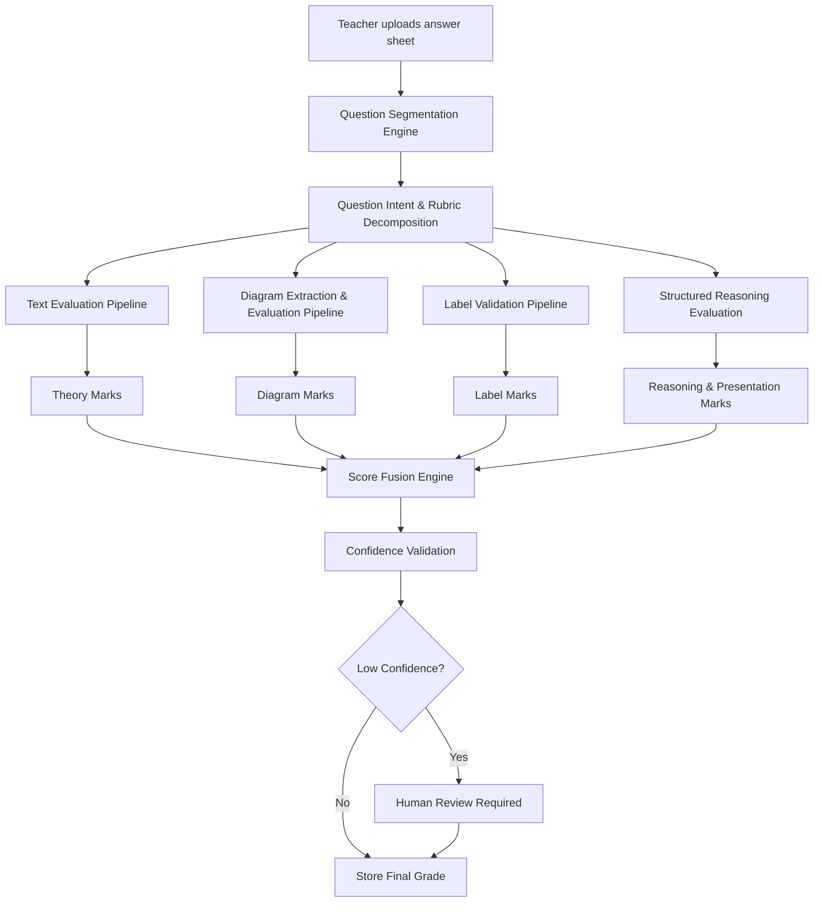

# Edexia AIOS Teacher Dashboard

Welcome to the **Edexia Frontend**, the central command center for teachers and evaluators utilizing the Edexia Assessment Intelligence Operating System.


# AI-Powered Multimodal Evaluation Infrastructure for Board Examination Systems

## Inspired by the Edexia Evaluation Philosophy

This proposal presents a next-generation AI-assisted evaluation infrastructure designed for large-scale board examination systems such as:
- CBSE
- ICSE
- State Boards
- Open School Boards
- Competitive Examination Bodies

The platform extends the rubric-grounded and explainable evaluation principles inspired by Edexia into a multimodal educational assessment system capable of evaluating:
- textual answers,
- diagrams,
- labels,
- structured reasoning,
- and mixed-format responses.

The objective is not to replace teachers, but to create:
- evaluator-assistance infrastructure,
- moderation intelligence,
- scalable answer-sheet processing,
- and transparent assessment workflows.

---

# Problem Statement

Current answer-sheet evaluation systems are heavily manual and difficult to scale consistently.

The major challenges include:
- evaluator fatigue,
- inconsistent marking,
- delayed result processing,
- subjective moderation,
- poor auditability,
- handling diagram-based answers,
- and difficulty maintaining fairness at scale.

Traditional AI grading systems also fail in educational environments because they typically evaluate:
- only text,
- only semantic similarity,
- or entire answers as a single block.

However, real board examination answers are multimodal.

A single answer may contain:
- textual explanation,
- labeled diagrams,
- formulas,
- reasoning steps,
- and structured presentation.

Therefore, evaluation must happen component-wise rather than treating the entire response as a single entity.

---

# Core Evaluation Philosophy

The proposed system follows the same foundational philosophy that made Edexia effective:

| Edexia Principle | Proposed Extension |
|---|---|
| Rubric-grounded evaluation | Board-specific component-based grading |
| Evidence-linked scoring | Explainable multimodal scoring |
| Teacher-assisted workflows | Human moderation and overrides |
| Curriculum-aware grading | Question-intent-aware evaluation |
| Structured evaluation | Parallel evaluation pipelines |
| Calibration support | Moderation analytics and consistency tracking |

The system evaluates answers the same way a trained examiner evaluates them:
- independently,
- rubric-wise,
- component-wise,
- and evidence-backed.

---

# Key Architectural Shift

Instead of evaluating the entire answer through a single grading flow, the proposed architecture first understands:

```text
What components are expected in this answer?
````

For example:

Question:

> Explain the working of human heart with a neat labeled diagram.

The system decomposes the expected answer into:

* theory explanation,
* biological correctness,
* diagram structure,
* labels,
* presentation quality.

Each component is evaluated independently and then combined into a final score.

This mirrors real human evaluation behavior.

---

# Proposed Execution Flow



---

# Why This Architecture is Important

This architecture solves a major limitation of traditional AI grading systems.

Most grading systems incorrectly assume:

```text
One answer = One evaluation process
```

But real educational evaluation works like this:

```text
One answer = Multiple independent scoring components
```

For example:

| Component              | Marks |
| ---------------------- | ----- |
| Explanation            | 4     |
| Conceptual Correctness | 2     |
| Diagram                | 3     |
| Labels                 | 1     |

The final score is produced only after evaluating each component separately.

This creates:

* fairness,
* explainability,
* consistency,
* and better moderation support.

---

# Diagram Evaluation Intelligence System (DEIS)

The platform includes a dedicated Diagram Evaluation Intelligence System responsible for:

1. Detecting diagrams
2. Extracting diagram regions
3. Validating relevance against the question
4. Understanding structure
5. Detecting labels
6. Mapping labels to diagram regions
7. Identifying missing components
8. Assigning partial marks
9. Producing explainable scoring evidence

The system does not simply detect whether a diagram exists.

It evaluates:

* whether the diagram is relevant,
* whether it is correct,
* whether labels are accurate,
* and whether required components are present.

---

# Parallel Multimodal Evaluation

The proposed system evaluates answer components independently.

## Text Evaluation Pipeline

Handles:

* explanations,
* derivations,
* theoretical reasoning,
* semantic understanding,
* and concept correctness.

---

## Diagram Evaluation Pipeline

Handles:

* structural correctness,
* relevance,
* labels,
* arrows,
* completeness,
* and diagram-specific rubric scoring.

---

## Label Evaluation Pipeline

Handles:

* handwritten labels,
* label placement,
* spatial mapping,
* and terminology correctness.

---

## Structured Reasoning Pipeline

Handles:

* stepwise logic,
* presentation,
* derivation flow,
* and procedural correctness.

---

# Rubric-Aware Question Decomposition

One of the most important components of the system is the Question Decomposition Engine.

Before evaluation begins, the system determines:

* what type of answer is expected,
* what scoring components exist,
* and how marks should be distributed.

Examples:

| Question Type        | Expected Components     |
| -------------------- | ----------------------- |
| Explain with diagram | text + diagram + labels |
| Draw circuit         | diagram only            |
| Define law           | text only               |
| Derive equation      | steps + formulas        |
| Label map            | diagram + labels        |

This creates dynamic evaluation workflows.

---

# Partial Marking System

The platform supports true rubric-based partial marking.

Marks are assigned incrementally based on:

* evidence,
* completeness,
* correctness,
* and rubric alignment.

Example:

| Component         | Marks |
| ----------------- | ----- |
| Correct structure | 1     |
| Labels            | 2     |
| Completeness      | 1     |
| Accuracy          | 1     |

The system never assigns marks without evidence.

---

# Explainability and Auditability

Every assigned mark contains supporting evidence.

The system maintains:

* scoring explanations,
* evidence regions,
* moderation logs,
* evaluator overrides,
* and confidence metadata.

This creates:

* transparency,
* moderation support,
* and legal defensibility.

---

# Human-in-the-Loop Evaluation

The system is designed as:

* evaluator assistance infrastructure,
* not evaluator replacement.

Low-confidence evaluations automatically trigger:

* mandatory human review.

Teachers remain:

* final moderators,
* reviewers,
* and decision-makers.

---

# Scalability Goals

The platform is designed for:

* large-scale national examinations,
* millions of answer sheets,
* distributed evaluation centers,
* multilingual answer sheets,
* and concurrent evaluation workflows.

The system supports:

* asynchronous processing,
* distributed execution,
* modular evaluation pipelines,
* and incremental scaling.

---

# Indian Board-Specific Adaptation

The platform is specifically designed for Indian educational environments.

It supports:

* multilingual answer sheets,
* mixed-language responses,
* poor handwriting,
* low-quality scans,
* STEM-heavy evaluations,
* and state-board-specific rubric structures.

---

# Expected Outcomes

| Metric                 | Current System | Proposed System       |
| ---------------------- | -------------- | --------------------- |
| Evaluation Time        | High           | Significantly Reduced |
| Manual Workload        | Very High      | Reduced               |
| Moderation Consistency | Variable       | Standardized          |
| Diagram Evaluation     | Manual         | AI-Assisted           |
| Auditability           | Limited        | Full Evidence-Based   |
| Rechecking Disputes    | Frequent       | Reduced               |
| Transparency           | Low            | High                  |

---

# Long-Term Vision

The proposed platform evolves beyond grading software into:

```text
National Educational Evaluation Infrastructure
```

Potential future applications include:

* board examinations,
* university assessments,
* engineering drawing evaluation,
* practical examination moderation,
* recruitment examinations,
* and digital academic audit systems.

