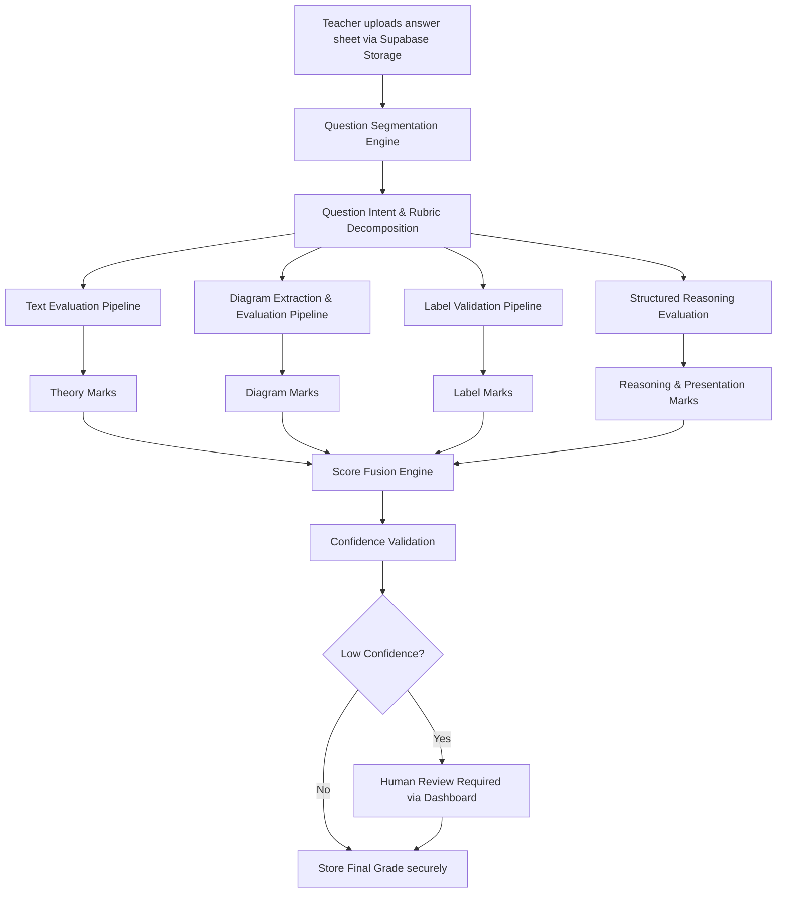

# OzymorLab

Welcome to the **Ozymorlab**, the central command center for teachers, administrators, and evaluators utilizing the Assessment Intelligence Operating System (AIOS).

# AI-Powered Multimodal Evaluation Infrastructure for Board Examination Systems

## Inspired by the **Edexia** Evaluation Philosophy

This platform is a next-generation AI-assisted evaluation infrastructure designed for large-scale board examination systems such as:
- CBSE
- ICSE
- State Boards
- Open School Boards
- Competitive Examination Bodies

The platform extends the rubric-grounded and explainable evaluation principles into a multimodal educational assessment system capable of evaluating:
- textual answers,
- diagrams,
- labels,
- structured reasoning,
- and mixed-format responses.

The objective is not to replace teachers, but to create:
- **Multi-Tenant Institutional command centers**,
- evaluator-assistance infrastructure,
- moderation intelligence,
- scalable answer-sheet processing,
- and transparent assessment workflows.

---

# Problem Statement

Current answer-sheet evaluation systems are heavily manual and difficult to scale consistently. Traditional AI grading systems fail in educational environments because they typically evaluate only text or only semantic similarity, often treating entire answers as a single block.

Real board examination answers are multimodal. A single answer may contain textual explanation, labeled diagrams, formulas, reasoning steps, and structured presentation. Therefore, evaluation must happen component-wise rather than treating the entire response as a single entity.

---

# Core Evaluation Philosophy

The system evaluates answers the same way a trained examiner evaluates them: independently, rubric-wise, component-wise, and evidence-backed.

| OzymorLab Principle | Platform Extension |
|---|---|
| Rubric-grounded evaluation | Board-specific component-based grading |
| Evidence-linked scoring | Explainable multimodal scoring |
| Teacher-assisted workflows | Human moderation and overrides |
| Curriculum-aware grading | Question-intent-aware evaluation |
| Structured evaluation | Parallel evaluation pipelines |
| Calibration support | Moderation analytics and consistency tracking |

---

# Multi-Tenant Institutional Architecture

To support massive adoption, the Frontend operates as a **Multi-Tenant Command Center**. Powered securely by **Supabase Authentication and Storage**, it enforces strict hierarchical visibility across the school ecosystem:

*   **Principal & Admins**: Full institutional visibility, bulk student/roster imports, school-wide statistical performance analytics, and educator role assignments.
*   **HOD (Head of Department)**: Gatekeepers of quality. They have department-level visibility and act as the final approval authority for AI-drafted grading rubrics before bulk evaluations can commence.
*   **Teachers & Evaluators**: Dedicated grading dashboards focusing purely on assigned tasks, flagging low-confidence AI grades for human moderation, and managing their own student cohorts.

All uploads, secure file storage, configurations are driven dynamically via Supabase integration to guarantee strict data segregation per tenant.

---

# Proposed Execution Flow

---

# Diagram Evaluation Intelligence System (DEIS)

The platform seamlessly communicates with the **DEIS microservice cluster**. DEIS does not simply detect whether a diagram exists. It structurally evaluates:

1. Whether the diagram is relevant and structurally correct using PyTorch and YOLOv8.
2. Whether handwritten labels are accurate and map to the right geometric regions.
3. Whether required rubric components are present, calculating determinist partial marks via NetworkX.

---

# CI/CD Pipeline (GitHub Actions)

To ensure the frontend is always highly available and performant, the repository utilizes a robust CI/CD pipeline. 
On every push and pull request, GitHub Actions automatically:
1. Installs the Node.js 20 environment.
2. Resolves all project dependencies.
3. Executes ESLint strict formatting checks to maintain codebase health.
4. Performs a Next.js Production Build (`npm run build`) to guarantee there are no rendering or compilation failures before deployment.

---

# Explainability and Auditability

Every assigned mark contains supporting evidence. The system maintains scoring explanations, evidence regions, moderation logs, evaluator overrides, and confidence metadata. 

This creates unparalleled transparency, robust moderation support, and legal defensibility at an institutional scale. Low-confidence evaluations automatically trigger mandatory human reviews, proving that teachers remain the final decision-makers.

---

# Long-Term Vision

The proposed platform evolves beyond grading software into a **National Educational Evaluation Infrastructure**. Future applications include board examinations, university assessments, practical examination moderation, recruitment examinations, and digital academic audit systems.

# Helping Organisation:

